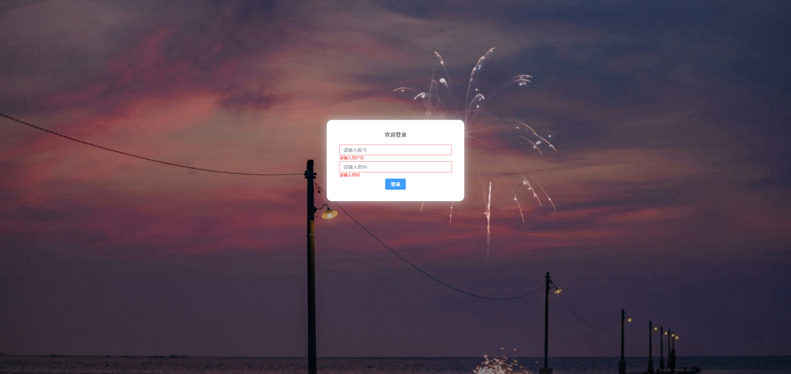
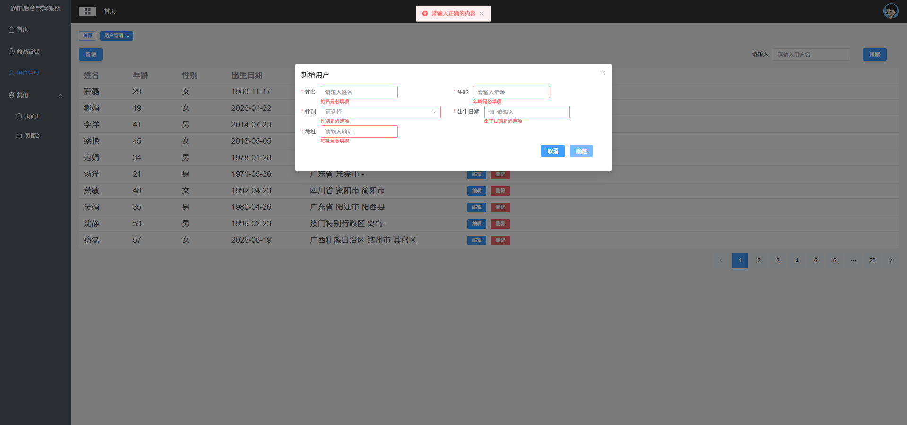
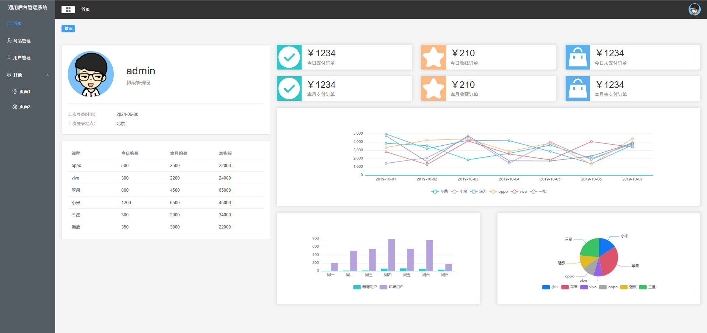

💼 Vue Admin System

基于 Vue3 + Vite + Pinia + Element Plus 的后台管理系统模板。  
这是我跟着 B 站视频教程做的项目，但并不是完全照搬，而是在理解原理的基础上做了结构优化与功能增强。

## 🎬 项目演示

## 📷 项目截图

### 登录页

### 用户管理页

### 多级菜单（递归组件实现）和首页

📌 仓库地址：https://github.com/LZY-csll/vue-admin-system

🚀 项目说明

本项目使用 pnpm 作为包管理工具（项目内包含 pnpm-lock.yaml），并基于 Vite 进行开发及构建。运行环境基于 Vue3 和主流生态插件实现后台权限及菜单系统。

这是一个纯前端项目，使用 mock 数据模拟接口返回，用于学习实践后台系统架构。  

用户名和密码是写死的，管理员用户：用户名和密码都是admin； 普通用户：用户名和密码都是xiaoxiao

##🛠 技术栈  

⚡ Vite + Vue 3

🧠 Pinia 状态管理

🔐 Vue Router 实现权限守卫

🎨 Element Plus UI 组件库

💾 pinia-plugin-persistedstate 实现状态持久化

📊 ECharts 图表库

📦 MockJS 模拟 API 数据  
  

##✨ 项目亮点（与教程相比的改进）  
  
📌 菜单递归组件

菜单使用递归组件实现，完整支持多级嵌套渲染，无需针对不同层级写分支逻辑，提高组件复用性。

🚧 权限控制通过路由守卫处理

通过全局路由守卫进行登录校验、越权拦截，而不是静态动态路由方式，逻辑更清晰便于扩展。

🧠 状态持久化

使用 pinia-plugin-persistedstate 做状态持久化，无需额外手写本地存储逻辑，使状态管理更简洁可靠。

🔄 完整登录/退出流程

实现完整用户登录流程：

登录成功保存 token 到状态

页面刷新保持登录状态

点击退出后清除 token 集中状态
并跳转至登录页
  

##📁 项目结构示例  

├── src/  
│   ├── api/                # 封装接口请求、使用 mock 模拟数据  
│   ├── assets/             # 图片、样式等静态资源  
│   ├── components/         # 公共组件（含递归菜单组件）  
│   ├── router/             # 路由定义与守卫逻辑  
│   ├── store/              # Pinia 状态管理与持久化配置  
│   ├── views/              # 视图页面（各业务页面）  
│   ├── App.vue             # 根组件  
│   ├── main.js             # 项目入口  
│   └── config/             # 请求真实接口还是模拟接口的一些配置  

确保已安装 pnpm：

pnpm install  
pnpm dev

启动后访问：

http://localhost:5173/

##📝 自我总结

这个项目不是简单的跟敲，而是在实现过程中：

✅ 理解了菜单递归与组件化设计  
✅ 理解了权限控制机制与路由守卫  
✅ 学会用插件提升代码质量与可维护性  
✅ 实现了登录退出等常见功能的完整流程  